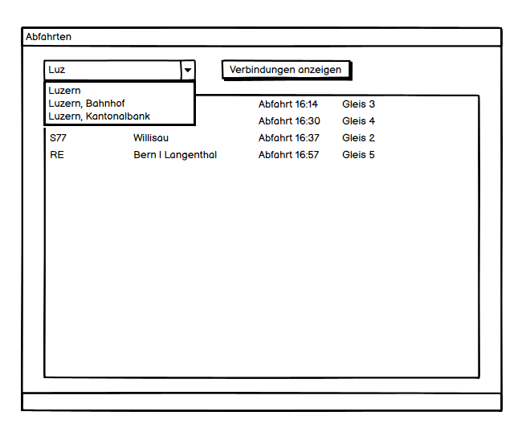
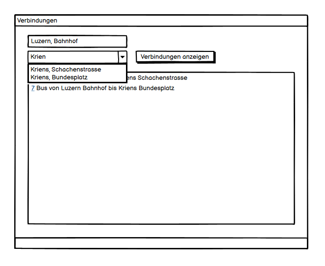

# M318 Projektarbeit "Oev-Pad" Dokumentation von Kris Huber

## Einleitung

### Über dieses Dokument

* Autor: **Kris Huber**
* Erstelldatum: **14.04.2022**

### Über das Projekt

Wir haben 12.04.2022 mit der Projektarbeit gestartet und am 14.04.2022 war der Abgabetermin.

### Über die Software

Die mit C#, Winforms, .Net Core entwickelte Software hat die Aufgabe, als eine grafische Benutzeroberfläche für die Opendata Transport API zu dienen.

### Zweck

Diese Dokumentation ist dazu da, um die Projektarbeit in menschlicher Sprache lesbar festzuhalten. Dazu enthält die Dokumentation weitere Informationen wie: User Stories & Planung (Prio), Testfälle und Mock Ups. Diese Dokumentation würde auch, wenn dieses Projekt in der Echtwelt eingesetzt würde, Benutzern helfen, die Software mit der Installationsanleitung zu installieren.

## User Stories

| ID    | User Story                                                   | Abnahmekriterien                                             | Priorität   | Umgesetzt |
| ----- | ------------------------------------------------------------ | ------------------------------------------------------------ | ----------- | --------- |
| **1** | **Verbindungssuche** Als Benutzer möchte ich mindestens die nächsten vier Verbindungen zwischen einer Start- und Endstation suchen können, um für mich eine passende Verbindung zu finden. | - Startstation in Textfeld eingeben  - Endstation in Textfeld eingeben - Listet mindestens nächsten vier Verbindungen auf | 1           | ✅         |
| **2** | **Abfahrtstafel** Als Benutzer möchte ich eine Abfahrtstafel, um alle Verbindungen einer Startstation zu sehen. | - Startstation in Textfeld eingeben - Anzeigen sämtlicher ausgehender Verbindungen von dort | 1           | ✅         |
| **3** | **Stationssuche** Als Benutzer möchte ich nach einer Station suchen können, um diese als Start- oder Endstation auswählen zu können. | - Anzeigen aller Stationen, die den Suchbegriff im Namen enthalten - Passende Station kann als Start-/Endstation ausgewählt werden | 1           | ✅         |
| **4** | **Stationssuche Autocomplete** Als Benutzer möchte ich bei der Eingabe der Stationssuche automatisch Vorschläge erhalten, um eine Station, deren Namen ich nicht genau kenne, einfacher zu finden. | - Autovervollständigung der Eingabe bei Stationssuche - Fuzzy Search | 2           | ✅         |
| **5** | **Datum und Uhrzeit Filter** Als Benutzer möchte ich ein Abfahrtsdatum und Uhrzeit eingeben können, um Verbindungen in der Zukunft einsehen zu können. | - Abfahrtsdatum auswählen - Abfahrtszeit auswählen - Entsprechende Verbindungen anzeigen | 2           | ✅         |
| **6** | **Nächste Stationen** Als Benutzer möchte ich die nächsten Stationen zu meinem Standort einsehen können, um zu wissen, wo ich am besten einsteigen soll. | - Standort erfassen - Alle Stationen im nahen Umkreis anzeigen  | 3           | ✅         |
| **7** | **Stationenkarte** Als Benutzer möchte ich eine Station auf einer Karte sehen können, um zu wissen, wo sich die Station befindet. | - Station auswählen - Station auf interaktiver Karte einzeichnen | 3           | ✅         |
| **8** | **Verbindung teilen** Als Benutzer möchte ich eine Verbindung per Email teilen können, um andere über eine Verbindung informieren zu können. | - Verbindung auswählen - Textfeld für Empfänger-Email Adresse - Textfeld für optionale Nachricht - Uhrzeit, Start- und Endstation der Verbindung an Empfänger senden | 3           | ✅         |
| **9** | **Take Me Home** Als Benutzer möchte ich einen "Take Me Home" Shortcut haben können, um mir die schnellste Verbindung von meinem aktuellen Standort zu meiner Heimadresse zu geben. | - Einstellung für Heimadresse - Standort erfassen - Nächste Startstation zum aktuellen Standort finden - Nächste Endstation zu Heimadresse finden  | Eigene Idee | ✅         |

## Mockups

### Abfahrtstafel

> User Story 2

### Verbindungssuche

> User Story 1

## Testfälle

### Computer-Zustand Anforderungen:

- Internetverbindung
- Oev-Pad Applikation geöffnet

### Verbindungen Suchen

**Anforderung:** 1

**Tab:** Connection Finder

| Schritt | Aktivität                                | Erwartetes Resultat                                          |
| ------- | ---------------------------------------- | ------------------------------------------------------------ |
| 1       | In die From TextBox "Zug" eingeben       | Autocomplete Vorschläge                                      |
| 2       | In die To TextBox "Luzern" eingeben      | Autocomplete Vorschläge                                      |
| 3       | Auf den "View Connection" Button drücken | Es werden mindestens 4 ÖV-Verbindungen angezeigt die mich von Zug nach Luzern bringen. |

---

### Abfartstafel

**Anforderung**: 2

**Tab:** Departure Board

| Schritt | Aktivität                                                    | Erwartetes Resultat                                          |
| ------- | ------------------------------------------------------------ | ------------------------------------------------------------ |
| 1       | Ich gebe "Luzern" in die Station Name TextBox                | Autocomplete Vorschläge                                      |
| 2       | Ich wähle von den Autocomplete Vorschlägen "Luzern, Bahnhof" aus | In der TextBox wird "Luzern, Bahnhof" eingesetzt             |
| 3       | Ich drücke auf den "View Departure Board" Button             | Es wird minestens eine Verbindung von dieser Station in der GridDataView angezeigt. |

---

### Station suchen

**Anforderungen:** 3, 4

**Tab:** Station Finder

| Schritt | Aktivität                                   | Erwartetes Resultat                                          |
| ------- | ------------------------------------------- | ------------------------------------------------------------ |
| 1       | In das Station Name Textfeld "Be" eingeben  | Es werden keine Vorschläge angezeigt.                        |
| 2       | In das Station Name Textfeld "Ber" eingeben | Es werden folgende Vorschläge im Dropdown angezeigt: "Bern", "Bern, Bahnhof", "Bern, Hirschengraben", "Bern, Zytglogge", "Bern, Wankdorf", "Bern, Bärenplatz", "Bern, Kocherplatz", "Bern, Brunnadernstrasse", "Bern, Helvetiaplatz", "Bern Europaplatz Süd" |
| 3       | Klicke auf den Button "Find"                | Es werden folgende Resultate in der ListView angezeigt: "Bern", "Bern, Bahnhof", "Bern, Hirschengraben", "Bern, Zytglogge", "Bern, Wankdorf", "Bern, Bärenplatz", "Bern, Kocherplatz", "Bern, Brunnadernstrasse", "Bern, Helvetiaplatz", "Bern Europaplatz Süd" |

### Verbindung mit Datum suchen

**Anforderung:** 5

**Tab:** Station Finder

| Schritt | Aktivität                                    | Erwartetes Resultat                                          |
| ------- | -------------------------------------------- | ------------------------------------------------------------ |
| 1       | In die From TextBox "Zug" eingeben           | Autocomplete Vorschläge                                      |
| 2       | In die To TextBox "Luzern" eingeben          | Autocomplete Vorschläge                                      |
| 3       | Die Checkbox "Custom Date" anwählen          | Der Datepicker ist nun anklickbar                            |
| 4       | Im DatePicker das Datum 21.04.2022 auswählen | Im DatePicker ist nun das Datum 21.04.2022 eingesetzt        |
| 3       | Auf den "View Connection" Button drücken     | Es werden mindestens 4 ÖV-Verbindungen angezeigt die mich am 21sten April 2022 von Zug nach Luzern bringen. |

---

### Station in der Nähe

**Anforderung:** 6

**Tab:** Station Finder

| Schritt | Aktivität                                     | Erwartetes Resultat                                     |
| ------- | --------------------------------------------- | ------------------------------------------------------- |
| 1       | Auf den "Find Nearest Station" Button drücken | In der ListView werden Station in meiner Nähe angezeigt |

---

### Karte

**Anforderung:** 7

**Tab:** Station Finder

| Schritt | Aktivität                                                    | Erwartetes Resultat                                          |
| ------- | ------------------------------------------------------------ | ------------------------------------------------------------ |
| 1       | Auf den "Find Nearest Station" Button drücken                | In der ListView werden Station in meiner Nähe angezeigt      |
| 2       | Eine der Stationen in der ListView anwählen und auf den "View Location in Browser" Button drücken | Der eingestellte standard Browser wird geöffnet und es wird auf Über Google Maps der Standort der Station angezeigt. |

---

### Verbindung teilen

**Anforderung:** 8

**Tab:** Connection Finder

| Schritt | Aktivität                                               | Erwartetes Resultat                                          |
| ------- | ------------------------------------------------------- | ------------------------------------------------------------ |
| 1       | In das Station Name Textfeld "Be" eingeben              | Es werden keine Vorschläge angezeigt.                        |
| 2       | In das Station Name Textfeld "Ber" eingeben             | Es werden folgende Vorschläge im Dropdown angezeigt: "Bern", "Bern, Bahnhof", "Bern, Hirschengraben", "Bern, Zytglogge", "Bern, Wankdorf", "Bern, Bärenplatz", "Bern, Kocherplatz", "Bern, Brunnadernstrasse", "Bern, Helvetiaplatz", "Bern Europaplatz Süd" |
| 3       | Klicke auf den Button "Find"                            | Es werden folgende Resultate in der ListView angezeigt: "Bern", "Bern, Bahnhof", "Bern, Hirschengraben", "Bern, Zytglogge", "Bern, Wankdorf", "Bern, Bärenplatz", "Bern, Kocherplatz", "Bern, Brunnadernstrasse", "Bern, Helvetiaplatz", "Bern Europaplatz Süd" |
| 4       | Ich wähle eine der Verbindungen  an                     | -                                                            |
| 5       | Ich drücke auf den "Share Connection over Email" button | Es erscheint ein Popup mit einem Externen Mail Client mit der ensprechender Verbindung im Body des Mails. |

---

### Take Me Home

**Anforderung:** 9

**Tab:** Connection Finder

| Schritt | Aktivität                                 | Erwartetes Resultat                                          |
| ------- | ----------------------------------------- | ------------------------------------------------------------ |
| 1       | Ich drücke auf den "Take Me Home" Button. | Wenn ich den Home Stop schon gesetzt habe wird dieser im to eingesetzt und im from wird die mir am nächsten Station eingesetzt und es werden Verbindungen angezeigt die mich nach Hause bringen. Falls den Home Stop noch nicht gesetzt habe wird ein Dialog aufgemacht der mich den Home Stop Setzten lässt |

## Testprotokoll

| Test | Testperson | Datum | Status|
| ----------- | --------- | ------ | --------------------------------- |
| Verbindungen suchen                  | Silas Reichlin | 14.04.2022 | ✅  |
| Abfartstafel | Silas Reichlin | 14.04.2022 | ✅ |
| Station suchen | Silas Reichlin | 14.04.2022 | ✅  |
| Verbindung suchen mit Datum und Zeit| Silas Reichlin | 14.04.2022 | ✅  |
| Station in der Nähe | Silas Reichlin | 14.04.2022 |✅ |
| Karte | Silas Reichlin |14.04.2022|✅ |
| Verbindung teilen | Silas Reichlin |14.04.2022|✅ |
| Take me Home | Silas Reichlin |14.04.2022|✅ |